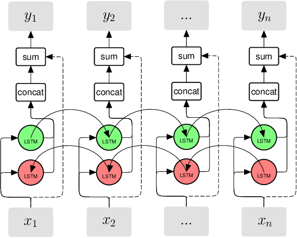
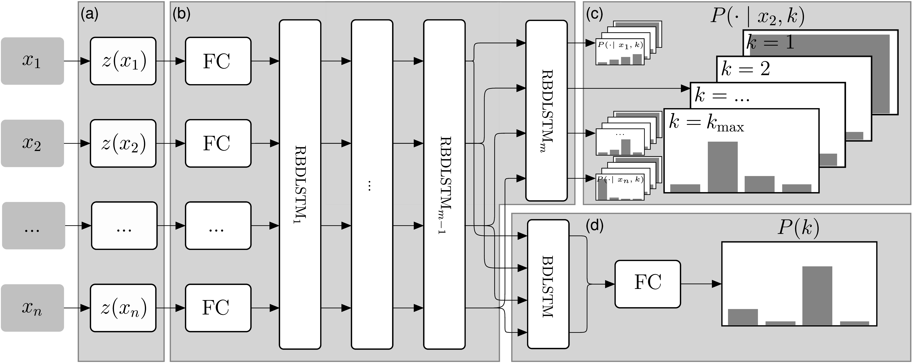
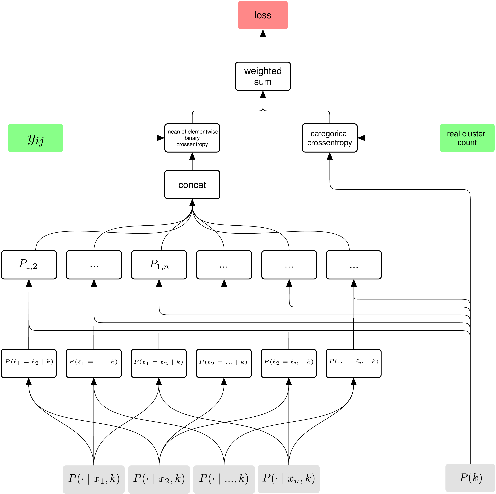
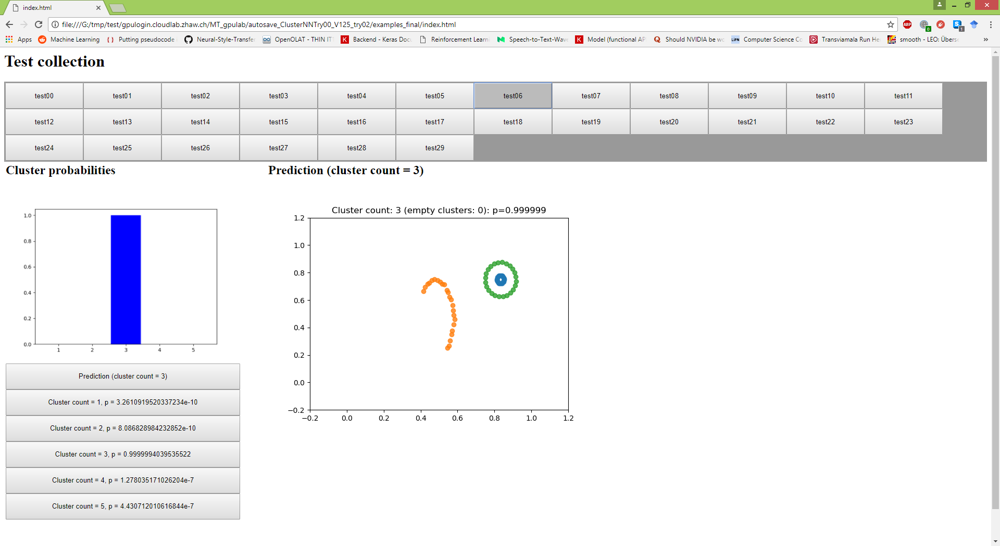
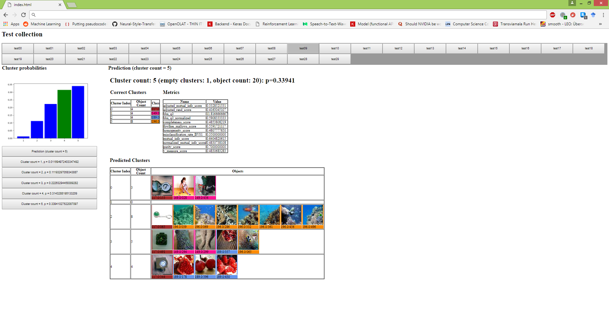
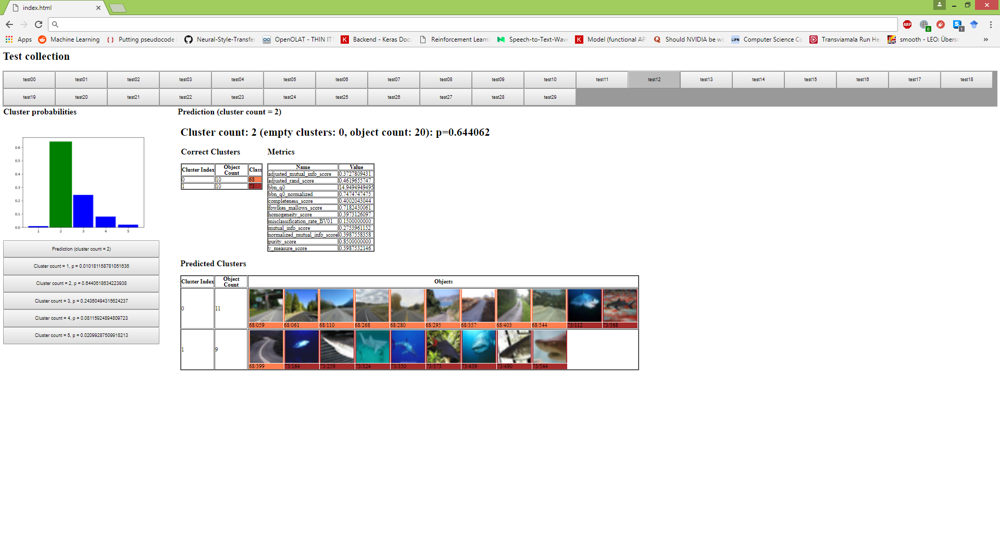

# Learning to Cluster - Investigations in Deep Learning for End-to-End Clustering

**THIS PAGE IS UNDER CONSTRUCTION**: Not all details may be available, but at the 2018-03-04 a stable version will be available (including much more documentation etc.).

## Basics
This repository contains the code which was used to develop the neural network model which is described in [doc/pdf/Paper.pdf](doc/pdf/Paper.pdf). There are three documents available:

- A short-version (which was submitted as a ICLR-workshop paper): [doc/pdf/ICLR_Paper.pdf](doc/pdf/ICLR_Paper.pdf)
	- ICLR-Workshop submission: [https://openreview.net/forum?id=HkWTqLsIz](https://openreview.net/forum?id=HkWTqLsIz)
- A long version with more details: [doc/pdf/Paper.pdf](doc/pdf/Paper.pdf)
- A thesis about this network, including many experiments and even more details: [doc/pdf/Thesis.pdf](doc/pdf/Thesis.pdf)

The described supervised end-to-end learning model can be used to cluster any type of data. It might be required to change the embedding-network (e.g. a CNN for images) for the given data type, but all the other parts of the network do not have to be changed.

The network highly depends on residual bi-directional LSTM-layers (RBDLSTM). These layers are like normal BDLSTM-layers, but they include a residual connection from the output to the input as can be seen on the following image:

<!---->

The network input is basically a set of examples. The amount can be different for each execution of the network. The output contains a softmax distribution for the cluster count (which has to be in a fixed range) and a classification for the cluster index for each object, given there are k clusters.

The network architecture is shown on the image below:

Because it cannot be defined what cluster index the network should use for a cluster, the loss function has to take this into account and we cannot just use a categorical crossentropy for the cluster index output. The loss function is very detailed described in the linked document in the beginning and visualized on the following figure:

## Implemented Datasets

Currently the following listed datasets can be used for the training. For each dataset the final experiment (which is described in the linked documents) is given:

- Image-Based datasets
	- Caltech-UCSD Birds 200: [http://www.vision.caltech.edu/visipedia/CUB-200.html](http://www.vision.caltech.edu/visipedia/CUB-200.html)
		- Final experiment: `./apps2/test_cluster_nn_try00_v124.py`
	- CIFAR10: [https://www.cs.toronto.edu/~kriz/cifar.html](https://www.cs.toronto.edu/~kriz/cifar.html)
		- Final experiment: -
	- CIFAR100: [https://www.cs.toronto.edu/~kriz/cifar.html](https://www.cs.toronto.edu/~kriz/cifar.html)
		- Final experiment: `./apps2/test_cluster_nn_try00_v132.py`
	- Devanagari-Characters: [https://www.kaggle.com/rishianand/devanagari-character-set/data](https://www.kaggle.com/rishianand/devanagari-character-set/data)
		- Final experiment: `./apps2/test_cluster_nn_try00_v142.py`
	- FaceScrub: [http://vintage.winklerbros.net/facescrub.html](http://vintage.winklerbros.net/facescrub.html)
		- Final experiment: `./apps2/test_cluster_nn_try00_v126.py`
	- FashionMNIST: [https://github.com/zalandoresearch/fashion-mnist](https://github.com/zalandoresearch/fashion-mnist)
		- Final experiment: -
	- Flowers 102: [http://www.robots.ox.ac.uk/~vgg/data/flowers/102/](http://www.robots.ox.ac.uk/~vgg/data/flowers/102/)
		- Final experiment: `./apps2/test_cluster_nn_try00_v148.py`
	- Labeled Faces in the Wild (LFW): [http://vis-www.cs.umass.edu/lfw/](http://vis-www.cs.umass.edu/lfw/)
		- Final experiment: `./apps2/test_cluster_nn_try00_v134.py`
	- MNIST: [http://yann.lecun.com/exdb/mnist/](http://yann.lecun.com/exdb/mnist/)
		- Final experiment: -
	- Tiny ImageNet: [https://tiny-imagenet.herokuapp.com/](https://tiny-imagenet.herokuapp.com/)
		- Final experiment: `./apps2/test_cluster_nn_try00_v129.py`
	- Cars-196: [http://ai.stanford.edu/~jkrause/cars/car_dataset.html](http://ai.stanford.edu/~jkrause/cars/car_dataset.html)
		- Final experiment: `./apps2/test_cluster_nn_try00_v131.py`
	- SUN397: [http://vision.cs.princeton.edu/projects/2010/SUN/](http://vision.cs.princeton.edu/projects/2010/SUN/)
		- Final experiment: `./apps2/test_cluster_nn_try00_v133.py`
	- COIL-100: [http://www.cs.columbia.edu/CAVE/software/softlib/coil-100.php](http://www.cs.columbia.edu/CAVE/software/softlib/coil-100.php)
		- Final experiment: `./apps2/test_cluster_nn_try00_v136.py`
- Audio
	- TIMIT: [https://catalog.ldc.upenn.edu/ldc93s1](https://catalog.ldc.upenn.edu/ldc93s1)
		- Final experiment: `./apps2/test_cluster_nn_try00_v122.py`
- Misc
	- 2D Point data including different shapes / cluster types
		- Final experiment: `./apps2/test_cluster_nn_try00_v130.py`

Other datasets may be implemented quite easy, especially image based datasets.

## Train the Network

In the directories `app` and `app2`, there are many experiments. They can be run with python. Each experiment produces in a defined interval example outputs. Intervals may be defined for the training set, the validation set and finally it can be defined that the test set should be used to produce some examples.

Assuming you want to run the experiment `./apps2/test_cluster_nn_try00_v130.py`: Inside the file there is at the beginning the variable `top_dir` which will be the output directory for the files which are created during the training. This path has to be changed. Some dataproviders require that a path to a dataset is given; in this case, this path also has to be adapted. Unfortunately, for most datasets it is not allowed to distribute them directly.

The examples always contain the predicted cluster count and the predicted clusters. For images examples with the same underlying class have the same border color and the correct class count is green. For all examples, there are always all scores and probabilities stored in seperate csv-files. Here are some examples:

